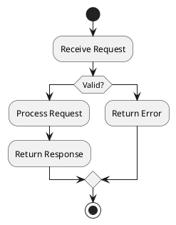
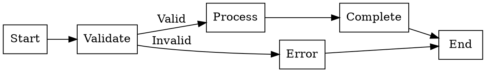

# Workflow Architect - Kali Linux Tool Mapping

**Agent:** 🗺️ Workflow Architect  
**Created:** April 10, 2026  
**Kali Version:** 2026.1  
**Total Tools:** 12  
**Status:** Complete

---

## Overview

**Mission:** Workflow tree mapping, failure mode analysis, handoff contracts, and process automation design.

**Primary Use Cases:**
- Workflow visualization and mapping
- Process documentation
- Failure mode analysis
- Handoff contract design
- Automation workflow creation
- Knowledge management

---

## 1. Workflow Visualization

### Diagramming Tools

| Tool | Package | Purpose | Command Example |
|------|---------|---------|-----------------|
| **draw.io** | draw.io (web) | Diagramming | Web/desktop application |
| **plantuml** | plantuml | UML diagrams | `plantuml diagram.puml` |
| **graphviz** | graphviz | Graph visualization | `dot -Tpng graph.dot -o output.png` |
| **mermaid** | mermaid (npm) | Markdown diagrams | Markdown integration |
| **yed** | yed (manual) | Graph editor | GUI application |

### PlantUML Examples


### Graphviz Example


---

## 2. Process Documentation

### Documentation Tools

| Tool | Package | Purpose | Command Example |
|------|---------|---------|-----------------|
| **obsidian** | obsidian (manual) | Knowledge base | Desktop app |
| **logseq** | logseq (manual) | Knowledge graph | Desktop app |
| **notion** | notion (web) | Workspace | Web application |
| **cherrytree** | cherrytree | Hierarchical notes | `cherrytree` (GUI) |

---

## 3. Workflow Automation

### Automation Platforms

| Tool | Package | Purpose | Command Example |
|------|---------|---------|-----------------|
| **n8n** | n8n (manual) | Workflow automation | Web interface |
| **node-red** | node-red | Flow-based programming | Web interface (1880) |
| **stackstorm** | stackstorm (manual) | Event-driven automation | Web interface |
| **huginn** | huginn (manual) | Agent-based automation | Web interface |

### Node-RED Example Flow
```json
[
  {
    "id": "workflow1",
    "type": "tab",
    "label": "Security Workflow",
    "disabled": false,
    "info": ""
  },
  {
    "id": "node1",
    "type": "http in",
    "z": "workflow1",
    "name": "Alert Webhook",
    "url": "/alert",
    "method": "post",
    "wires": [["node2"]]
  },
  {
    "id": "node2",
    "type": "function",
    "z": "workflow1",
    "name": "Parse Alert",
    "func": "msg.priority = msg.body.severity; return msg;",
    "wires": [["node3"]]
  },
  {
    "id": "node3",
    "type": "switch",
    "z": "workflow1",
    "property": "priority",
    "rules": [
      {"t":"eq", "v":"critical"},
      {"t":"eq", "v":"high"},
      {"t":"else"}
    ],
    "wires": [["pagerduty"], ["slack"], ["log"]]
  }
]
```

### n8n Workflow Example
```json
{
  "nodes": [
    {
      "name": "Security Alert",
      "type": "n8n-nodes-base.webhook",
      "parameters": {
        "path": "security-alert",
        "httpMethod": "POST"
      }
    },
    {
      "name": "Classify Severity",
      "type": "n8n-nodes-base.switch",
      "parameters": {
        "rules": {
          "string": [
            {"value": "critical"},
            {"value": "high"},
            {"value": "medium"}
          ]
        }
      }
    },
    {
      "name": "Notify Team",
      "type": "n8n-nodes-base.slack",
      "parameters": {
        "channel": "#security-alerts",
        "text": "={{ $json.message }}"
      }
    }
  ]
}
```

---

## 4. Failure Mode Analysis

### Analysis Tools

| Tool | Package | Purpose | Command Example |
|------|---------|---------|-----------------|
| **fault-tree** | fault-tree (manual) | Fault tree analysis | Specialized tool |
| **failure-mode** | failure-mode (manual) | FMEA analysis | Spreadsheet/template |

### FMEA Template
```
| Component | Failure Mode | Effect | Severity | Cause | Occurrence | Detection | RPN |
|-----------|--------------|--------|----------|-------|------------|-----------|-----|
| Auth API  | Service down | No login | 9 | Server crash | 3 | Monitoring | 27 |
| Database  | Data loss | Data unavailable | 10 | Disk failure | 2 | Backups | 20 |
| Network   | High latency | Slow response | 5 | Congestion | 4 | Monitoring | 20 |
```

---

## 5. Handoff Contracts

### Contract Design

| Aspect | Description | Example |
|--------|-------------|---------|
| **Input Schema** | Expected input format | JSON schema |
| **Output Schema** | Expected output format | JSON schema |
| **Error Handling** | Error response format | Standard error codes |
| **SLA** | Performance expectations | Response time, uptime |
| **Retry Logic** | Retry behavior | Exponential backoff |

### Handoff Contract Template
```yaml
service: Security Scanner
version: 1.0.0

input:
  type: object
  properties:
    target:
      type: string
      format: uri
    scan_type:
      type: string
      enum: [quick, full, compliance]
  required:
    - target
    - scan_type

output:
  type: object
  properties:
    scan_id:
      type: string
    status:
      type: string
      enum: [pending, running, complete, failed]
    findings:
      type: array
      items:
        type: object

sla:
  response_time: <5s
  completion_time: <30min
  uptime: 99.9%

error_codes:
  400: Invalid input
  401: Unauthorized
  404: Target not found
  500: Internal error
  503: Service unavailable
```

---

## Top 10 Workflow Architect Tools

| # | Tool | Category | Why Essential |
|---|------|----------|---------------|
| 1 | **Draw.io** | Diagramming | Versatile diagramming |
| 2 | **PlantUML** | Diagramming | Text-based diagrams |
| 3 | **Graphviz** | Visualization | Graph visualization |
| 4 | **n8n** | Automation | Workflow automation |
| 5 | **Node-RED** | Automation | Flow-based programming |
| 6 | **Obsidian** | Documentation | Knowledge management |
| 7 | **Logseq** | Documentation | Knowledge graph |
| 8 | **Mermaid** | Diagramming | Markdown diagrams |
| 9 | **CherryTree** | Documentation | Hierarchical notes |
| 10 | **StackStorm** | Automation | Event-driven automation |

---

## Quick Reference Commands

### Diagram Generation
```bash
# PlantUML to PNG
plantuml diagram.puml

# Graphviz to PNG
dot -Tpng workflow.dot -o workflow.png
neato -Tpng graph.dot -o graph.png
circo -Tpng graph.dot -o graph.png

# Mermaid CLI
mmdc -i diagram.mmd -o diagram.png
```

### Node-RED
```bash
# Start Node-RED
node-red

# Access web interface
# http://localhost:1880

# Import flow
# Web interface → Menu → Import
```

---

## Pre-Installed vs Manual Install

### Pre-Installed in Kali 2026.1

| Category | Tools |
|----------|-------|
| **Diagramming** | Graphviz, PlantUML |
| **Documentation** | CherryTree |

### Manual Install Required

| Tool | Install Method | Notes |
|------|----------------|-------|
| **Draw.io** | Web/Desktop | Diagramming |
| **Obsidian** | Download | Knowledge base |
| **Logseq** | Download | Knowledge graph |
| **n8n** | npm/Docker | Workflow automation |
| **Node-RED** | npm | Flow-based programming |
| **StackStorm** | apt/Docker | Event-driven automation |
| **Mermaid** | npm | Markdown diagrams |
| **YEd** | Download | Graph editor |

---

## Workflow Documentation Template

```markdown
# Workflow: [Name]

## Overview
[Brief description]

## Trigger
[What starts the workflow]

## Steps
1. [Step 1]
2. [Step 2]
3. [Step 3]

## Handoffs
| From | To | Data | SLA |
|------|-----|------|-----|
| Service A | Service B | JSON payload | <5s |

## Failure Modes
| Component | Failure | Mitigation |
|-----------|---------|------------|
| Service A | Timeout | Retry 3x |

## Monitoring
[Key metrics to track]

## Owner
[Team/person responsible]
```

---

**Document Version:** 1.0  
**Created:** April 10, 2026  
**Author:** KaliKlaw Security Assistant  
**Next Review:** Quarterly  
**Owner:** Security Team
